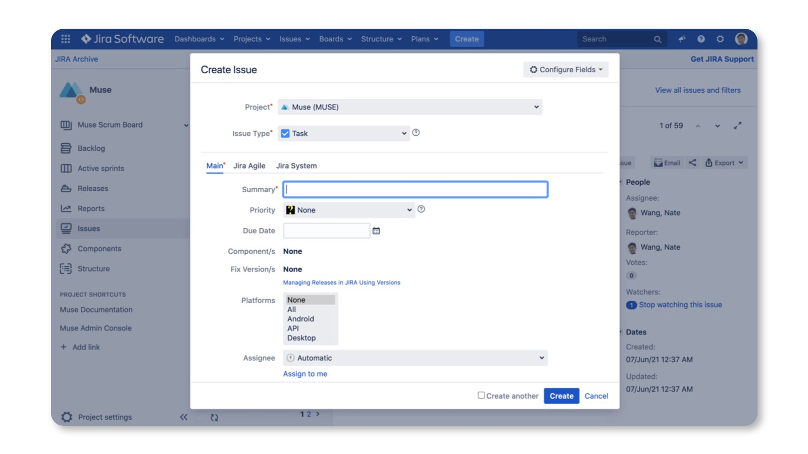

# Manage Modals in a Natural Way

with react context

Yedidya Rashi

---

<style scoped>
section {
  display: flex;
  flex-direction: column;
  justify-content: center;
  text-align: center;
}
</style>

# What We're Going to Cover

---

## Motivation

Using modals in React is a bit frustrating. Think of that if you need to implement below UI:


---

<style scoped>
section {
  display: flex;
  flex-direction: column;
  justify-content: center;
}
</style>

```typescript
const Root = () => {
  const [visible, setVisible] = useState(false);
  // other logic ...
  return (
    <>
      <Main />
      <NewTicketModal visible={visible} />
    </>
  );
};
```

---

### However, when you declare the modal in the root component, there are some issues

1. Not scalable. It's unreasonable to maintain the modal's state in the root component. When you need more modals you need to maintain much state, especially you need to maintain arguments for the modal.

2. It's hard to show or hide the modal from children components. When you maintain the state in a component then you need to pass setVisible down to the place where you need to show or hide the modal. It makes things too complicated.

---

# Rethink the Modal Usage Pattern in React

According to the [wikipedia](https://en.wikipedia.org/wiki/Modal_window), a modal can be described as:

> A window that prevents the user from interacting with your application until he closes the window.

---

# Requirements

- A modal is a global view that is not necessarily related to a specific context.

- It is similar to a page in a single-page UI application but allows users to perform separate tasks without leaving the current page.

- Modals can be displayed above any page or component.
  The visibility and state of modals should be managed globally.

---

### The Solution - @ebay/nice-modal-react

<style scoped>
li {
  font-size: 34px;
}
</style>

- Zero dependency and small: ~2kb after gzip.
- Uncontrolled. You can close modal itself in the modal component.
- Decoupled. You don't have to import a modal component to use it. Modals can be managed by id.
- The code of your modal component is not executed if it's invisible.
- It doesn't break the transitions of showing/hiding a modal.
- Promise based. Besides using props to interact with the modal from the parent component, you can do it easier by promise.
- Easy to integrate with any UI library.

---

```typescript
import { Modal } from "antd";
import NiceModal, { useModal } from "@ebay/nice-modal-react";

export default NiceModal.create(({ name }) => {
  // Use a hook to manage the modal state
  const modal = useModal();
  return (
    <Modal
      title="Hello Antd"
      onOk={() => modal.hide()}
      visible={modal.visible}
      onCancel={() => modal.hide()}
      afterClose={() => modal.remove()}
    >
      Hello {name}!
    </Modal>
  );
});
```

---

<style scoped>
section {
  display: flex;
  flex-direction: column;
  justify-content: center;
  text-align: center;
}
</style>

# [Examples](https://opensource.ebay.com/nice-modal-react/)

---

<style scoped>
section {
  display: flex;
  flex-direction: column;
  justify-content: center;
  text-align: center;
}
</style>

# Questions

---

<style scoped>
section {
  display: flex;
  flex-direction: column;
  justify-content: center;
  text-align: center;
}
</style>

# Thank You!
